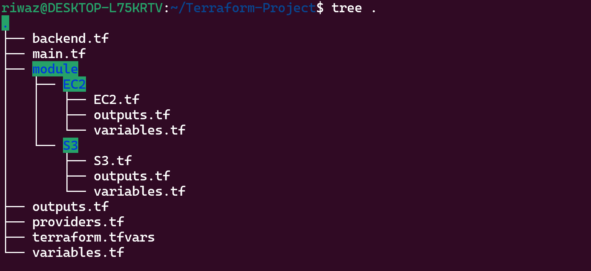

# Terraform modules – EC2 & Secure S3 Buckets

### 📌 Overview

This project provisions an AWS infrastructure using **Terraform modules**, including:

- A **VPC with public subnet and SG**
- An **EC2 instance with EBS and EIP**
- A **secure S3 main bucket**
- A **secure S3 log bucket** for access logging


📂 Module Structure


**▶️ How to Run**

```jsx
terraform init
```

```jsx
terraform plan
```

```jsx
terraform apply
```

### ✅ Key Learnings

- Correct use of **Terraform modules**
- Importance of **exact variable naming**
- Secure S3 configuration using Terraform
- Handling cross-resource dependencies
- Debugging Terraform variable loading issues